<p align="center">
  <h1 align="center">Retrieval-Augmented Generation pipeline</h1>
  <p align="center">
    <strong>Build a production-ready Retrieval-Augmented Generation pipeline from the ground up.</strong>
  </p>
  <p align="center">
    <a href="#-quick-start">Quick Start</a> •
    <a href="#-architecture">Architecture</a> •
    <a href="#-project-structure">Project Structure</a> •
    <a href="#-api-reference">API Reference</a> •
    <a href="#-configuration">Configuration</a> •
    <a href="#-docker">Docker</a> •
    <a href="#-contributing">Contributing</a>
  </p>
  <p align="center">
    
    
    
    
    
  </p>
</p>

---

## Overview

**RAG from Scratch** is a modular, extensible template for building Retrieval-Augmented Generation systems without relying on black-box frameworks. Every component — from document loading to LLM generation — is implemented from first principles, giving you full control and understanding of the pipeline.

### Key Features

| Feature | Description |
|---|---|
| **Multi-Format Ingestion** | Load PDF, DOCX, XLSX, PPTX, TXT, and Markdown files |
| **Smart Chunking** | Recursive character-aware text splitting with configurable overlap |
| **Local Embeddings** | Sentence-Transformers (`all-MiniLM-L6-v2`) — no API keys required |
| **Dual Vector Store** | In-memory store for development, Redis for production |
| **Semantic Retrieval** | Cosine-similarity search with top-k and metadata filtering |
| **Local LLM** | Ollama integration (Llama 3.2, Mistral, etc.) — fully offline |
| **Caching Layer** | Redis-backed embedding and query cache with configurable TTL |
| **REST API** | FastAPI server with document ingestion, querying, and admin endpoints |
| **Docker Ready** | Multi-stage Dockerfile for containerized deployments |

---

## Architecture

### System Architecture Diagram (generated using gemini)


The diagram above illustrates the complete RAG pipeline architecture, showing:
- **Ingestion Flow** (left): Document loading → Text splitting → Embedding → Vector storage
- **Query Flow** (right): User query → Embedding → Similarity search → Context retrieval → LLM generation
- **Infrastructure**: Redis for vector storage and caching, Ollama for local LLM inference

---

### Data Flow Sequence

```mermaid
sequenceDiagram
    participant U as 👤 User
    participant API as ⚡ FastAPI
    participant IS as IngestionService
    participant RS as RetrievalService
    participant VS as VectorStore (Redis)
    participant LLM as Ollama LLM

    Note over U, LLM: 📥 Document Ingestion Flow
    U->>API: POST /ingest/upload (file)
    API->>IS: process_document(file)
    IS->>IS: load → split → embed
    IS->>VS: store(chunks + vectors)
    VS-->>API: ✅ stored
    API-->>U: 200 OK (doc_id, chunk_count)

    Note over U, LLM: 🔍 Query & Generation Flow
    U->>API: POST /query/ask (question)
    API->>RS: query(question)
    RS->>RS: embed(question)
    RS->>VS: similarity_search(query_vector, top_k)
    VS-->>RS: relevant chunks
    RS->>RS: build_prompt(question, chunks)
    RS->>LLM: generate(prompt)
    LLM-->>RS: answer
    RS-->>API: answer + sources
    API-->>U: 200 OK (answer, citations)
```



---

## 🚀 Quick Start

### Prerequisites

| Dependency | Purpose | Install |
|---|---|---|
| **Ollama 3.2+** | Local LLM | [ollama.com](https://ollama.com/) |
| **Python 3.10+** | Runtime | [python.org](https://www.python.org/downloads/) |
| **Redis** | Vector store & cache | [redis.io](https://redis.io/download) |

### 1. Clone & Install

```bash
git clone https://github.com/shubhamauti9/retrieval-augmented-generation.git
cd retrieval-augmented-generation

# Create virtual environment
python -m venv venv
source venv/bin/activate   # Linux/macOS
venv\Scripts\activate      # Windows

# Install dependencies
pip install -r requirements.txt
```

### 2. Start Infrastructure

```bash
# Start Ollama (Docker)
docker run -d --name ollama -p 11434:11434 ollama/ollama

# Start Redis (Docker)
docker run -d --name redis -p 6379:6379 redis:7-alpine
```

### 3. Run the API Server

```bash
uvicorn api.main:app --host 0.0.0.0 --port 8000 --reload
```

The API will be available at:
- **Swagger UI** → [http://localhost:8000/docs](http://localhost:8000/docs)
- **ReDoc** → [http://localhost:8000/redoc](http://localhost:8000/redoc)

### 4. Try It Out

```bash
# Upload a document
curl -X POST http://localhost:8000/ingest/upload \
  -F "file=@your_document.pdf" \
  -F "collection=default"

# Ask a question
curl -X POST http://localhost:8000/query/ask \
  -H "Content-Type: application/json" \
  -d '{"question": "What is the main topic of the document?", "collection": "default"}'
```

---

## Project Structure

```
rag-from-scratch/
│
├── api/                              # FastAPI application layer
│   ├── main.py                       # App entrypoint, middleware, routes
│   ├── config.py                     # Settings via pydantic-settings (.env)
│   ├── models.py                     # Pydantic request/response models
│   ├── routers/
│   │   ├── ingest.py                 # POST /ingest/upload, /ingest/text
│   │   ├── query.py                  # POST /query/ask, /query/search
│   │   └── admin.py                  # GET /admin/health, collections mgmt
│   └── services/
│       ├── ingestion.py              # Document processing orchestration
│       └── retrieval.py              # Query processing & LLM orchestration
│
├── src/                              # Core RAG library (framework-agnostic)
│   ├── loaders/                      # Document loaders
│   │   ├── base_loader.py            # Abstract base class
│   │   ├── pdf_loader.py             # PDF → text (pypdf)
│   │   ├── docx_loader.py           # Word documents (python-docx)
│   │   ├── excel_loader.py           # Excel files (openpyxl)
│   │   ├── pptx_loader.py           # PowerPoint (python-pptx)
│   │   ├── text_loader.py            # Plain text / Markdown
│   │   └── directory_loader.py       # Batch load from directory
│   │
│   ├── text_splitters/               # Text chunking strategies
│   │   ├── recursive_character_text_splitter.py
│   │   └── ...
│   │
│   ├── embeddings/                   # Embedding generation & caching
│   │   ├── embedding_model.py        # Sentence-Transformers wrapper
│   │   └── embedding_cache.py        # Cache layer for embeddings
│   │
│   ├── vector_stores/                # Vector storage backends
│   │   ├── base_vector_store.py      # Abstract interface
│   │   ├── in_memory_vector_store.py # Development / testing store
│   │   └── redis_vector_store.py     # Production Redis store
│   │
│   ├── retrievers/                   # Retrieval strategies
│   │   ├── base_retriever.py         # Abstract retriever
│   │   └── vector_store_retriever.py # Cosine similarity retrieval
│   │
│   ├── chains/                       # Pipeline orchestration
│   │   └── rag_chain.py              # Full RAG chain (retrieve → prompt → generate)
│   │
│   ├── prompts/                      # Prompt engineering
│   │   └── prompt_template.py        # Configurable prompt templates
│   │
│   ├── cache/                        # Redis caching infrastructure
│   │   ├── redis_manager.py          # Redis connection management
│   │   ├── embedding_cache.py        # Embedding-level caching
│   │   └── query_cache.py            # Query result caching
│   │
│   └── utils/                        # Shared utilities
│       ├── document.py               # Document data class
│       └── similarity.py             # Cosine similarity functions
│
├── data/                             # Runtime data (gitignored)
├── Dockerfile                        # Multi-stage production build
├── pyproject.toml                    # Project metadata & dependencies
├── requirements.txt                  # Pinned dependencies
├── .gitignore
├── .dockerignore
└── README.md
```

---

## API Reference

### Ingestion Endpoints

| Method | Endpoint | Description |
|---|---|---|
| `POST` | `/ingest/upload` | Upload a file (PDF, DOCX, XLSX, PPTX, TXT, MD) |
| `POST` | `/ingest/text` | Ingest raw text directly |

### Query Endpoints

| Method | Endpoint | Description |
|---|---|---|
| `POST` | `/query/ask` | Ask a question and get an LLM-generated answer with sources |
| `POST` | `/query/search` | Semantic search — returns relevant chunks without generation |

### Admin Endpoints

| Method | Endpoint | Description |
|---|---|---|
| `GET` | `/admin/health` | Health check with system status |
| `GET` | `/admin/collections` | List all document collections |
| `DELETE` | `/admin/collections/{name}` | Delete a collection and its documents |

> Full interactive documentation available at `/docs` (Swagger UI) when the server is running.

---

## Configuration

All settings are managed via **environment variables** with the `RAG_` prefix, or through a `.env` file.

| Variable | Default | Description |
|---|---|---|
| `RAG_DEBUG` | `false` | Enable debug mode |
| `RAG_EMBEDDING_MODEL` | `all-MiniLM-L6-v2` | Sentence-Transformers model name |
| `RAG_EMBEDDING_DIM` | `384` | Embedding vector dimensions |
| `RAG_LLM_MODEL` | `llama3.2` | Ollama model name |
| `RAG_LLM_BASE_URL` | `http://localhost:11434` | Ollama server URL |
| `RAG_CHUNK_SIZE` | `500` | Max characters per chunk |
| `RAG_CHUNK_OVERLAP` | `100` | Overlap between consecutive chunks |
| `RAG_DEFAULT_TOP_K` | `5` | Number of chunks to retrieve |
| `RAG_REDIS_HOST` | `localhost` | Redis server host |
| `RAG_REDIS_PORT` | `6379` | Redis server port |
| `RAG_REDIS_PASSWORD` | — | Redis password (optional) |
| `RAG_REDIS_ENABLED` | `true` | Use Redis vs in-memory store |
| `RAG_EMBEDDING_CACHE_TTL` | `604800` | Embedding cache TTL (7 days) |
| `RAG_QUERY_CACHE_TTL` | `3600` | Query cache TTL (1 hour) |

#### Note: 
- `RAG_EMBEDDING_CACHE_TTL` and `RAG_QUERY_CACHE_TTL` can be customized based on your needs. For example, you can set `RAG_EMBEDDING_CACHE_TTL` to `0` to disable embedding cache, or set `RAG_QUERY_CACHE_TTL` to `0` to disable query cache
- 'RAG_CHUNK_SIZE' and 'RAG_CHUNK_OVERLAP' can be customized based on your needs. For example, you can set `RAG_CHUNK_SIZE` to `0` to disable chunking, or set `RAG_CHUNK_OVERLAP` to `0` to disable overlap

### Example `.env`

```env
RAG_DEBUG=true
RAG_LLM_MODEL=llama3.2
RAG_REDIS_HOST=redis
RAG_REDIS_PORT=6379
RAG_CHUNK_SIZE=500
RAG_DEFAULT_TOP_K=5
```

---

## Docker

### Build & Run

```bash
# Build the image
docker build -t rag-pipeline .

# Run the container
docker run -p 8000:8000 \
  -e RAG_REDIS_HOST=host.docker.internal \
  -e RAG_LLM_BASE_URL=http://host.docker.internal:11434 \
  rag-pipeline
```

### Docker Compose (Recommended)

Create a `docker-compose.yml` for the full stack:

```yaml
version: "3.9"

services:
  api:
    build: .
    ports:
      - "8000:8000"
    environment:
      - RAG_REDIS_HOST=redis
      - RAG_REDIS_PORT=6379
      - RAG_LLM_BASE_URL=http://host.docker.internal:11434
    depends_on:
      - redis

  redis:
    image: redis:7-alpine
    ports:
      - "6379:6379"
    volumes:
      - redis_data:/data

volumes:
  redis_data:
```

```bash
docker compose up -d
```

---

## How It Works — Step by Step

Understanding each stage of the RAG pipeline:

### 1. Document Loading
Documents are loaded using format-specific loaders that extract text and preserve metadata (filename, page numbers, sheet names).

### 2. Text Splitting
Long documents are split into overlapping chunks using `RecursiveCharacterTextSplitter`. The overlap ensures context is not lost at chunk boundaries.

### 3. Embedding Generation
Each chunk is converted into a 384-dimensional vector using the `all-MiniLM-L6-v2` model from Sentence-Transformers. Embeddings are cached in Redis to avoid redundant computation.

### 4. Vector Storage
Embeddings and their associated text chunks are stored in Redis (production) or an in-memory store (development). Redis uses sorted sets and hash maps for efficient similarity search.

### 5. Semantic Retrieval
When a query arrives, it is embedded using the same model. The vector store performs cosine similarity search to find the top-k most relevant chunks.

### 6. Prompt Construction
Retrieved chunks are injected into a structured prompt template that instructs the LLM to answer based only on the provided context.

### 7. LLM Generation
The prompt is sent to a LLM which generates a grounded answer with source citations.

---

## Development

```bash
# Install dev dependencies
pip install -e ".[dev]"

# Run tests
pytest --cov=src --cov-report=html

# Format code
black src/ api/

# Lint
ruff check src/ api/
```

---

## License

This project is licensed under the [MIT License](LICENSE).

---
